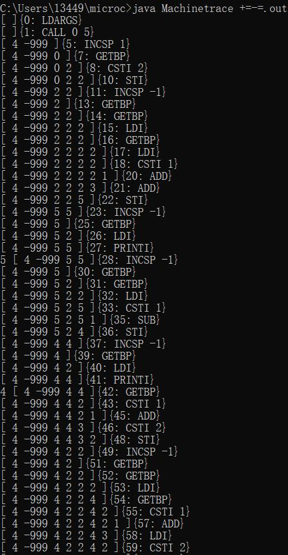

2019-2020学年第1学期

## 实 验 报 告


- 课程名称: <u>编程语言原理与编译</u>
- 实验项目: <u>编译原理大作业</u>
- 专业班级: <u>计算机1703</u>
- 学生学号: <u>31701424</u>
- 学生姓名: <u>王志伟</u>
- 实验指导教师:<u>郭鸣</u>
-  GitHub：https://github.com/fireworks-EX/microc


---

## 简介
编译原理大作业，基于microC。

因为时间与个人水平都较为有限，添加功能对基础语法进行了完善，并修改对应的基于续写的优化编译器contcomp。


## 结构
- 前端：由`F#`语言编写而成  
  - `Absyn.fs` ——抽象语法树
  - `CLex.fsl`——生成的`CLex.fs`词法分析器
  - `CPar.fsy`——生成`CPar.fs`语法分析器
  - `Interp.fs`——解释器
  - `Contcomp.fs`——编译器
- 后端：由`Java`语言编写而成
  - `Machine.java`生成`Machine.class`虚拟机与`Machinetrace.class`堆栈追踪
- 测试集：测试程序 ++--.c、+=-=.c、for.c、test.c
- 库：`.net`支持
  - `FsLexYacc.Runtime.dll`
## 用法

- //生成词法扫描器 和 语法分析器
  fslex --unicode CLex.fsl
  fsyacc --module CPar CPar.fsy

- //启动fsi
fsharpi -r FsLexYacc.Runtime.dll Absyn.fs CPar.fs CLex.fs Parse.fs Interp.fs ParseAndRun.fs

- //运行解释器
  open ParseAndRun;;

  run (fromFile "++--.c") [];;
  run (fromFile "+=-=.c") [];;
  run (fromFile "for.c") [];;
  run (fromFile "test.c") [];;

- //启动fsi
fsharpi -r FsLexYacc.Runtime.dll Absyn.fs CPar.fs CLex.fs Parse.fs Machine.fs Contcomp.fs ParseAndContcomp.fs    

- //运行编译器
  open ParseAndContcomp;;

  contCompileToFile (fromFile "++--.c") "++--.out";;
  contCompileToFile (fromFile "+=-=.c") "+=-=.out";;
  contCompileToFile (fromFile "test.c") "test.out";;
  contCompileToFile (fromFile "for.c") "for.out";;

- //生成虚拟机
  javac Machine.java

- //查看栈帧
  java Machinetrace ++--.out
  java Machinetrace +=-=.out
  java Machinetrace test.out
  java Machinetrace for.out

-  注：

  - `fromString`：从字符串中进行编译
  
  - `fromFile`：从文件中进行编译
  
  - `compileToFile`：生成中间表示
  
  - 解释执行
  
    
  
  - 编译执行
  
    
  
    


## 功能实现
- ### 自增自减(++、--)

- 例子：
  
    ```C
    //++--.c
    void main(){
    	int i;
    	i = 2;
    	print i;
    	++i;
    	print i;
    	--i;
    	print i;
    }
    ```
    
    - 解释执行+语法树： 
      
    
    
    
    - 编译执行： 
    
    - 
    
      
    
    - 查看栈帧：
    
      

---
- ### +=、-=、*=、/=、%=
  
- 例子：

    ```c
    //+=-=.c
    void main(){
    	int i;
    	i = 2;
    	i += i+1;
    	print i;
    	i -= 1;
    	print i;
    	int j;
    	j = 2;
    	i *= j*2;
    	print i;
    	i /= j;
    	print i;
    	i %= i;
    	print i;
    }
    ```

    - 解释执行+语法树： 
      

    - 编译执行： 

      

      

    - 查看栈帧：

      
---
- ### for循环

- 例子：

  ```c
  //for.c
  void main(){
  	int i;
  	for(i=0;i<10;++i) {print i;}
  }
  ```

  - 解释执行+语法树： 
    

  - 编译执行： 

  - 

    

  - 查看栈帧：

    

------

- ### 三目运算符a?b:c

- 用例：

  ```c
  //test.c
  void main(){
  	int i; 
  	int j; 
  	i=0; 
  	j=3; 
  	j>i?print 5:print 2;
  }
  ```

  - 解释执行+语法树： 
    

  - 编译执行： 

  - 

    

  - 查看栈帧：

    

------

## 技术评价

只改变了基础的语法，对于自己个人而言感觉难度还行（适中），但对于实现编译器的技术难度而言因为语法属于较为基础的层面，所以可以认为总体难度偏低。

| 功能               | 实例              | 对应文件         | 自评 |
| ------------------ | ----------------- | ---------------- | ---- |
| ++、--             | ++i;              | ++--.c、++--.out | 4    |
| +=、-=、*=、/=、%= | i+=1;             | +=-=.c、+=-=.out | 4    |
| for                | for(i=0;i<n;i++); | for.c、for.out   | 5    |
| 三目               | a>b?a:b           | test.c、test.out | 5    |

------

## 分工

| 成员   | 分工         |
| ------ | ------------ |
| 王志伟 | 全部（单刷） |


------

## 心得感想

​		一学期过得很快，从开始对编译原理一窍不通，通过一学期的学习，慢慢变得一知半解，自认为远远说不上了解与熟练，还有很大的空间可以精进。

​		在做大作业的过程中也遇到不少的坑，开始其实想做点异常处理等比较有难度与特色的功能，但是由于时间确实有限，在尝试失败后考虑到最后万一无法实现，可能会挂科。权衡之下，为了最后能成功交上作业，只好战术性放弃。

​		这学期大作业有5个，最后为了完成作业，时间着实有点赶，对于编译原理有很多地方来不及深思便囫囵吞枣，对于续算的优化的理解和掌握也不够深入，最终只完成了基础部分的语法也着实有些可惜。虽说这门课结束后，平时可能用不太上，但是在这个过程中虽然不多但对于语言的基础、计算的本质也有了更深入的了解，而且对于通过这门学到的思想我想对于将来的学习、工作亦或是生活都必带来裨益吧。

