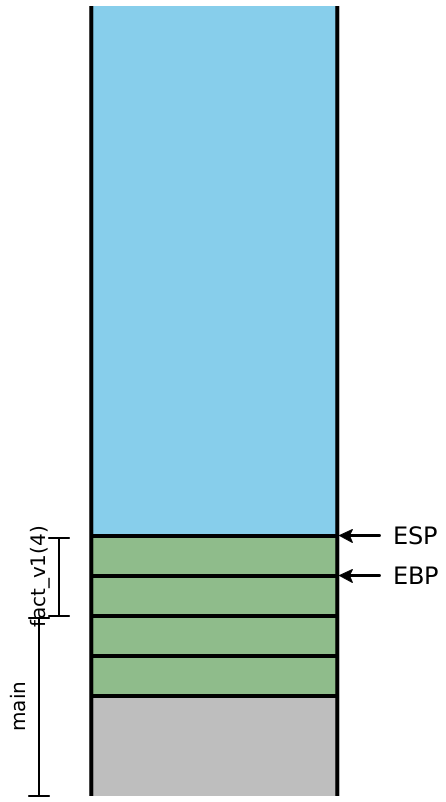
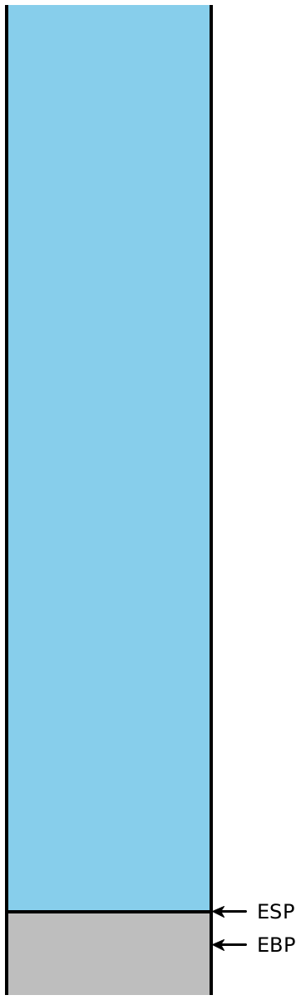

## 第9讲：正确的尾部调用：更好地使用堆栈

------

[TOC]

------


### 1 、一个激励人心的例子

编译器的工作是忠实地将一种语言的语义翻译成另一种语言。这很明显。但是，并非所有的翻译都是平等的：有些翻译可能比其他翻译效率更高，以至于它们改变了我们可以实际有效运行的程序。不过，这并不是关于*优化*的主张。优化通常将性能提高某个常数倍，这意味着所需/占用特定资源（时间，内存，IO等）的数量会减少几分之一。在这里，我们关心的是编译语言的普遍存在的功能——函数调用，一种在我们的程序中提供*渐近的*改进的方式。

假设我们有一个任意长度的列表，并且我们想检测其中是否存在一个值。我们自然会写，

```ocaml
let rec member (haystack : int list) (needle : int) : bool =
  match haystack with
  | [] -> false
  | first::rest ->
    if (needle == first) then true else (member rest needle)
```

这个函数的实际限制是什么？从概念上讲，它应该适用于我们构建的任何列表。但实际上，这段代码可能会在冗长的列表上崩溃，原因仅在于递归进行得太深：我们遇到了*堆栈溢出*，因为我们无法为下一个递归调用分配栈帧。这令人不满意：我们的语言语义对递归的深度没有任何限制。显然，我们运行该程序的任何计算机都可以*构建*很长的列表。并且这个问题看起来似乎无法处理！

但是，更仔细地查看该程序，这个失败更加令人失望。当`if`条件为假时，我们进入else分支并递归调用`member`。但是请注意，当该调用返回时，该函数只是将返回值作为*其*答案传递回去，而无需进一步处理！我们需要一个栈帧来处理/存放递归调用，但是当该调用返回后，我们基本上不再需要*当前的*栈帧。也许我们可以以某种方式合并两者，而不需要任何额外的空间？


### 2、一个简单的例子(A simpler example)

让我们考虑一下Diamondback中具有类似递归结构的程序。我们可以计算阶乘函数，而不是通过列表数据结构。

```Diamondback
def fact_v1(n):
  if n <= 1: 1
  else: n * fact_v1(n - 1)
```

乍一看，这与`member`的结构不符，因为在递归调用`fact(n - 1)`之后，我们还有其他工作要做。但是，我们已经学会了把这个程序转换成类似的程序——我们使用累加器参数，并按如下所示重写代码：

```Diamondback
def fact-tail(n, acc):
  if n <= 1: acc
  else: fact-tail(n - 1, n * acc)

def fact_v2(n):
  fact-tail(n, 1)
```

比较和对比这两个函数的求值顺序，使用我们开始的课程的模型求值：

```Diamondback
fact_v1(4) ==> if 4 <= 1: 1 else 4 * fact_v1(3)
           ==> 4 * fact_v1(3)
           ==> 4 * (if 3 <= 1: 1 else 3 * fact_v1(2))
           ==> 4 * (3 * fact_v2(2))
           ==> 4 * (3 * (if 2 <= 1: 1 else 2 * fact_v1(1)))
           ==> 4 * (3 * (2 * fact_v1(1)))
           ==> 4 * (3 * (2 * (if 1 <= 1: 1 else 1 * fact_v1(0))))
           ==> 4 * (3 * (2 * (1)))
           ==> 4 * (3 * 2)
           ==> 4 * 6
           ==> 24

fact_v2(4) ==> fact_tail(4, 1)
           ==> if 4 <= 1: 1 else fact-tail(4 - 1, 4 * 1)
           ==> fact_tail(3, 4)
           ==> if 3 <= 1: 1 else fact-tail(3 - 1, 3 * 4)
           ==> fact_tail(2, 12)
           ==> if 2 <= 1: 1 else fact-tail(2 - 1, 2 * 12)
           ==> fact_tail(1, 24)
           ==> if 1 <= 1: 1 else fact-tail(1 - 1, 1 * 24)
           ==> 24
```

初始版本保留一堆乘法等待，直到最内层的函数调用返回为止。可以合理地认为，在我们的已编译代码中，每段代码都将对应一个栈帧，并且显然的，我们仍然需要跟踪中间值`n` 以计算最终答案。

但是，该函数的第二个版本对`fact-tail`挂起/等待的调用永远不会超过一个 。在此求值序列中，没有什么看起来像需要深度调用堆栈的。我们能做到吗？


### 3、定义尾部位置(Defining tail position)

递归调用`fact_v1`和`fact_tail`的区别是什么？直观地说，在从函数返回之前，我们将它们描述为“最后要做的事情”。我们说这样的表达式*在尾部位置*，我们可以通过查看我们语言中的每种表达式形式来明确定义这些位置：

1. 表达式（在我们程序中）位于尾部。
2. 函数的主体位于尾部位置。
3. 如果let绑定位于尾部位置，则（a）它的主体处于尾部位置，但（b）绑定本身不处于尾部位置。
4. 如果条件在尾部位置，则（a）它的分支在尾部位置，但是（b）条件本身不在尾部位置。
5. 运算符的操作数永远不会位于尾部位置。在视觉上，绿色表达式始终位于尾部位置，黄色表达式可能位于尾部位置，而红色表达式绝不在尾部位置：

在视觉上，绿色表达式始终位于尾部位置，黄色表达式可能位于尾部位置，而红色表达式绝不在尾部位置：

```ocaml
type 'a aprogram = (* whole programs *)
  | AProgram of ~hl:2:s~'a adecl list~hl:2:e~ * ~hl:3:s~'a aexpr~hl:3:e~ * 'a      (* Rule 1 *)
and 'a adecl = (* function declarations *)
  | ADFun of string * string list * ~hl:3:s~'a aexpr~hl:3:e~ * 'a  (* Rule 2 *)
and 'a aexpr = (* anf expressions *)
  | ALet of string * ~hl:2:s~'a cexpr~hl:2:e~ * ~hl:1:s~'a aexpr~hl:1:e~ * 'a      (* Rule 3 *)
  | ACExpr of ~hl:1:s~'a cexpr~hl:1:e~
and 'a cexpr = (* compound expressions *)
  | CIf of ~hl:2:s~'a immexpr~hl:2:e~ * ~hl:1:s~'a aexpr~hl:1:e~ * ~hl:1:s~'a aexpr~hl:1:e~ * 'a   (* Rule 4 *)
  | CPrim1 of prim1 * ~hl:2:s~'a immexpr~hl:2:e~ * 'a              (* Rule 5 *)
  | CPrim2 of prim2 * ~hl:2:s~'a immexpr~hl:2:e~ * ~hl:2:s~'a immexpr~hl:2:e~ * 'a (* Rule 5 *)
  | CImmExpr of ~hl:1:s~'a immexpr~hl:1:e~
and 'a immexpr = (* immediate expressions *)
  | ImmNum of ~hl:1:s~int~hl:1:e~ * 'a
  | ImmBool of ~hl:1:s~bool~hl:1:e~ * 'a
  | ImmId of ~hl:1:s~string~hl:1:e~ * 'a
```

如果我们愿意，我们可以将其整理为一种标记操作，

```ocaml
mark_tails : ('a aprogram) -> bool aprogram
```

实际上，我们可能不需要这样做，而是可以通过我们的`compile`函数携带一个布尔值标志，该标志跟踪我们的尾部位置状态：

```ocaml
let rec compile_prog (prog : 'a aprog) =
  match prog with
  | AProg(decls, body, _) ->
    ... List.map compile_decl decls ...
    ... compile_aexp body ~hl:3:s~true~hl:3:e~ ...  (* Rule 1 *)
and compile_decl (decl : 'a adecl) =
  match decl with
  | ADFun(name, args, body, _) ->
    ... compile_aexp body ~hl:3:s~true~hl:3:e~ ...  (* Rule 2 *)
and compile_aexp (aexp : 'a aexpr) (tail_pos : boolean) =
  match aexp with
  | ALet(name, bind, body, _) ->
    ... compile_cexp bind ~hl:2:s~false~hl:2:e~ ... (* Rule 3b *)
    ... compile_aexp body ~hl:1:s~tail_pos~hl:1:e~  (* Rule 3a *)
  | ACExpr(e, _) -> compile_cexp e tail_pos
and compile_cexp (cexp : 'a cexpr) (tail_pos : boolean) =
  match cexp with
  | CIf(c, t, f, _) ->
    ... compile_imm c ~hl:2:s~false~hl:2:e~ ...     (* Rule 4a *)
    ... compile_aexp t ~hl:1:s~tail_pos~hl:1:e~ ... (* Rule 4b *)
    ... compile_aexp f ~hl:1:s~tail_pos~hl:1:e~ ... (* Rule 4b *)
  | CPrim1(op, arg, _) ->
    ... compile_imm arg ~hl:2:s~false~hl:2:e~ ...   (* Rule 5 *)
  | CPrim2(op, l, r, _) ->
    ... compile_imm l ~hl:2:s~false~hl:2:e~ ...     (* Rule 5 *)
    ... compile_imm r ~hl:2:s~false~hl:2:e~ ...     (* Rule 5 *)
  | CImmExpr(i, _) ->
    ... compile_imm i ~hl:1:s~tail_pos~hl:1:e~ ...
```

> ***现在就做！***
>
> 扩展此定义以包括`CApp`表达式。


### 4、检查堆栈(Examining the stack)

让我们考虑一下`fact_v1`求值时堆栈的外观 。在此图中，颜色指示某个栈帧 在堆栈上*使用*了特定的值，而括号表示某个栈帧在堆栈上*创建*了一个特定的值。

| At`fact_v1(4)`       |      | At`fact_v1(3)`       |      | At`fact_v1(2)`       |      | At`fact_v1(1)`       |      | About to return      |
| -------------------- | ---- | -------------------- | ---- | -------------------- | ---- | -------------------- | ---- | -------------------- |
|  |      |  |      |  |      |  |      |  |

现在，让我们检查一下`fact_v2`的堆栈，假设我们一直像以前一样编译代码。这次，我们将包含局部变量：

| At`fact_tail(4, 1)`   |      | At`fact_tail(3, 4)`   |      | At`fact_tail(2, 12)`  |      | At`fact_tail(1, 24)`  |      | About to return       |
| --------------------- | ---- | --------------------- | ---- | --------------------- | ---- | --------------------- | ---- | --------------------- |
|  |      |  |      |  |      |  |      |  |

因为这里的递归调用都在尾部位置，接下来的四个指令*都*将是`ret`指令，这意味着该栈的整体可以在一个步骤中被消除。换句话说，一旦橄榄色栈帧调用深绿色的栈帧，我们就再也不需要访问橄榄色栈帧。仔细观察堆栈，我们可以看到，*下一个*值`n`和 `acc`正是*前一个*堆栈帧在计算的局部变量 ，而且，每个堆栈帧具有完全相同的形状。如果不是创建一个*新的栈帧*，而是简单地*重用*现有的栈帧 ，那么我们就不需要*常数* 的堆栈深度来提供*任意*调用深度！


### 5 、策略(Strategy)

不将下一组参数简单地放到堆栈上，而只需将它们放入现有的堆栈中`EBP + 8` ,`EBP + 12`的位置。一旦我们这样做了，我们需要重新输入我们现有的函数，但是我们不能使用`call`指令做这件事。

> ***现在就做！***
>
> 为什么不呢？

`call`指令的含义是将返回地址压入堆栈，然后跳转到目标地址。但是我们已经将返回地址放在堆栈上了！我们也保存了`EBP`在堆栈上，这意味着这里实际上并不需要我们通常执行的函数语言。因此，我们将直接*跳转*到代码中的下一条指令。编译后的程序`fact_tail`将大致如下所示（忽略所有标记检查，并稍微简化条件）：

```X86 Assembly
fact_tail:
fact_tail_prologue:
  push EBP
  mov EBP, ESP
  sub ESP, 8            ; reserve stack slots
fact_tail_body:
  mov EAX, [EBP + 8]    ; load n
  cmp EAX, 2            ; compare to representation of 1
  jg keep_going
  mov EAX, [EBP + 12]   ; load acc into answer
  mov ESP, EBP          ; and return directly
  pop EBP               ; to the original
  ret                   ; caller
keep_going:
  mov EAX, [EBP + 8]    ; \
  sub EAX, 2            ; | compute n - 1
  mov [EBP - 4], EAX    ; /
  mov EAX, [EBP + 8]    ; \
  sar EAX, 1            ; |
  imul EAX, [EBP + 12]  ; | compute n * acc
  mov [EBP - 8], EAX    ; /
  mov EAX, [EBP - 4]    ; \
  mov [EBP + 8], EAX    ; / OVERWRITE argument n
  mov EAX, [EBP - 8]    ; \
  mov [EBP + 12], EAX   ; / OVERWRITE argument acc
  jmp fact_tail_body    ; AND RESTART fact_tail
```

这段代码清晰易读，我们可以很轻松地将其转换为C语言代码：

```c
int fact_tail(int n, int acc) {
  while (true) {
    if (n <= 1) { return acc; }
    else {
      int temp1 = n - 1;
      int temp2 = n * acc;
      n = temp1;
      acc = temp2;
    }
  }
}

```

我们已经将（tail-）递归函数转换为while循环，并消除了所有函数调用！


### 6、实施陷阱(Implementation pitfalls)

#### 6.1、重用参数(Reusing arguments)

考虑以下代码：

```Diamondback
def max(x, y):
  if y >= x: y
  else: max(y, x)

```

这显然是尾递归，所以我们可以应用上面的相同的技术。因为我们没有中间表达式（再次简化条件），我们甚至根本不需要移动`ESP`，因为我们所有的值已经在堆栈中：

```X86 Assembly
max:
max_prologue:
  push EBP
  mov EBP, ESP
max_body:
  mov EAX, [EBP + 12]   ; load y
  cmp EAX, [EBP + 8]    ; compare to x
  jl keep_going
  mov EAX, [EBP + 12]   ; load y into answer
  mov ESP, EBP          ; and return directly
  pop EBP               ; to the original
  ret                   ; caller
keep_going:
  mov EAX, [EBP + 12]   ; \
  mov [EBP + 8], EAX    ; / OVERWRITE argument x
  mov EAX, [EBP + 8]    ; \
  mov [EBP + 12], EAX   ; / OVERWRITE argument y
  jmp max_body          ; AND RESTART max

```

> 现在就做！
>
> 什么地方出了问题？

> 练习
>
> 尝试修复它。

尝试通过两个简单的调用来跟踪`max`，以测试`if`表达式的两个分支，并仔细地逐步执行生成的程序集。如果调用`max(10, 20)`，那么我们会进入`jl`指令，并最终返回`[EBP + 12]`，这 `y`与预期的一样。但是，假设我们尝试一下`max(20, 10)`。然后进入`keep_going`，加载的当前值 `[EBP + 12]`并用`[EBP + 8]`将它覆盖，即复制`y`到中`x`。然后，我们加载的当前值 `[EBP + 8]`并将其复制到`[EBP + 12]`中，以尝试将当前值`x`复制到`y`中—— 但此时，`x`的值消失了！因此，我们的尾调用 `max(y, x)`是`(10, 10)`，然后执行条件的第一个分支并返回`10`。

（请注意，如果我们以其他顺序更新参数，以至于我们在重写`y`之前就重写了`x`，我们将面临一个更隐蔽的问题：这个特定的函数将计算出正确的答案！我们的调用`max(10, 20)`将调用 `max(20, 20)`并返回`20`—— 纯粹是巧合的正确答案。如果我们更改程序以计算最小值，那么这种相反的参数替换顺序将再次引起问题。）

问题是我们调用的新参数位于我们将要覆盖的地址中，我们已经设法创建了一个循环，从` y `的地址得到新参数`x `的值，再从`x `的地址的到新参数`y `的值。我们简单地`mov`的天真策略太简单了。相反，我们可以尝试以下任何一种策略来增加复杂性(或其他类似的策略):

- 在每个函数的开头，只需将所有参数复制到新的局部变量中，然后就不再直接使用这些参数。这样可以确保我们不会像上面那样有循环，因此我们的尾调用将始终有效。另一方面，我们将使用所需堆栈空间的两倍。
- 在每次尾调用之前，将所有新的参数值`push`放入堆栈，然后`pop`它们（以相反的顺序）放入正确的位置。这是安全的，但是每个尾调用都会比临时使用需要更多的堆栈空间。
- 检查是否有*任何*参数值来自我们将要覆盖的地址。如果是这样，请使用上面的`push`/ `pop`方法；如果不是，请使用更简单的`mov`方法。
- 如本例`max`所示，检查新参数值与其位置之间是否存在循环。对于每个循环，通过将一个值压入堆栈，然后根据需要`mov`其余参数，然后`pop`将循环的最后一个参数压入其位置来中断循环。对于其他任何参数，只需根据需要`mov`即可。

上面的最后一个策略是最优的：它一次只使用一个额外的堆栈，并且使用的`mov`和堆栈操作数最少。但这显然也是最复杂的，因此也是最难测试和保证正确的方法。倒数第二个策略在效率和简单性之间取得了良好的平衡：安全条件易于检查，基于`push`/ `pop`的代码和基于`mov`的代码都以统一的方式处理所有参数，从而使测试变得更加容易。


#### 6.2、改变参数(Changing arities)

上面的技术不局限于*自我*递归。它也适用于函数之间的尾调用，这意味着相互递归的函数也可以被编译成本质上具有多个条件的while循环。

然而，上面的技术只对尾端调用有效，这些调用的大小不大于调用者的大小。假设函数F调用函数G，其深度为𝐴𝐺。假设G尾调用另一个函数H的深度 AH > AG。我们有两个问题:

- 首先，没有足够的空间将现有的参数替换为预期的新参数。我们需要将保存的EBP和返回地址向上移动几个堆栈槽，它们本身可能正在使用(这些可能是我们想要使用的新参数值!)，所以我们也必须移动它们。这个代价很容易变得昂贵。
- 其次，更重要的是，考虑`H` 最后返回到时发生的情况`F`（注意：`G`不再存在；这就是尾部调用的意思）。F将弹出它推送到堆栈上的AG参数…但是现在确实有一些AH的参数，所以ESP会出现在错误的地方!换句话说，到目前为止我们描述的调用约定不能支持对更多参数的函数的尾调用。

显然，这些困难不是无法克服的，但确实需要一些聪明的思考...


### 7、测试(Testing)

测试尾调用并不比测试常规调用困难多少，并且在涵盖所有情况时也需要同样的努力。将任何尾部调用转换为非尾部调用是很简单的，例如通过添加0或by或 使用`false`。构造尾递归测试程序，其递归深度应使堆栈溢出，然后使用这些技巧之一将尾调用转换为非尾调用，并确认只有尾调用程序才能运行完毕。

或者，我们可以实现一个新的原语`printStack`，该原语向我们输出当前程序的“堆栈跟踪”，并确认尾递归堆栈跟踪适当短，而非尾递归堆栈跟踪特别长。

如别名部分所述，我们必须仔细测试我们的参数替换代码不会引入无意义的循环，从而产生错误的结果。测试的难度取决于处理这些情况的启发式方法的复杂性。除非最大的效率是最重要的，否则选择一个稍微次优的编译策略并权衡/牺牲一些性能以获得对正确性的更大信心是有意义的。


### 8、适用性(Applicability)

> 现在就做！
>
> 这在实践中是否重要？

是的。我们已经更改了编译代码的性能从𝑂(𝑛) 到 𝑂(1),这意味着我们不再有人为的限制在我们可以用递归函数求解的问题上。

> 现在就做！
>
> 好的，但这肯定是一个学术问题，是功能语言的设计缺陷！当然*真实*像OO这样的语言不需要做这些工作，对吧？

[是的，他们有。](https://eighty-twenty.org/2011/10/01/oo-tail-calls)